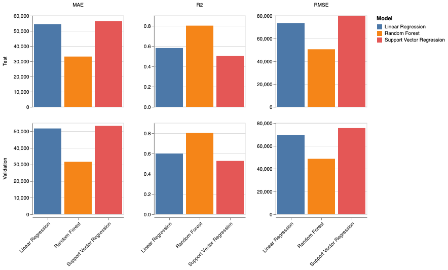

# Using Machine Learning To Predict House Prices

### Overview

This project aimed to implement and evaluate a variety of machine learning models to predict the 'median_house_value' from a given dataset. The primary objective was to conduct a comparative analysis of these models to determine the most effective one for our specific task. We approached this by performing exploratory data analysis, identifying and handling anomalies, selecting relevant features, and splitting the data into training, validation, and testing sets. The models tested include Linear Regression, Support Vector Regression (SVR), and Random Forest, with each model undergoing thorough evaluation using metrics such as Mean Absolute Error (MAE), Root Mean Squared Error (RMSE), and R-Squared (R2).

The analysis was conducted through the use of a Jupyter Notebook which can be viewed [here](https://nbviewer.org/github/NathanDawson/Machine-Learning/blob/main/Machine-Learning.ipynb).

### Performance Metric Results

### Conclusion

Throughout this project, we engaged in a rigorous analytical process, exploring the potential of various machine learning models in predicting house values. Our journey began with Linear Regression, which provided a foundational understanding of the task. We then moved on to Support Vector Regression (SVR), which built upon the Linear Regression model with a more robust approach to data fitting. However, due to computational constraints, extensive hyperparameter tuning with SVR was limited.

Random Forest emerged as the standout model. Its efficiency in handling non-linear relationships and robustness made it particularly suitable for our dataset. Through the use of GridSearchCV, we were able to fine-tune Random Forest, optimising its performance within reasonable computational limits. The performance of each model was evaluated based on MAE, RMSE, and R2, with Random Forest consistently outperforming the others across all metrics.

Our analysis suggests that Random Forest is the most effective model for predicting 'median_house_value' in this specific context. It not only demonstrated the highest accuracy and consistency in predictions but also maintained robustness across various data scenarios. This project underscores the importance of model selection and the balancing act between computational efficiency and predictive power in machine learning tasks. While Linear Regression and SVR offered valuable insights, Random Forest's superior performance positions it as the best model for this particular regression task.

